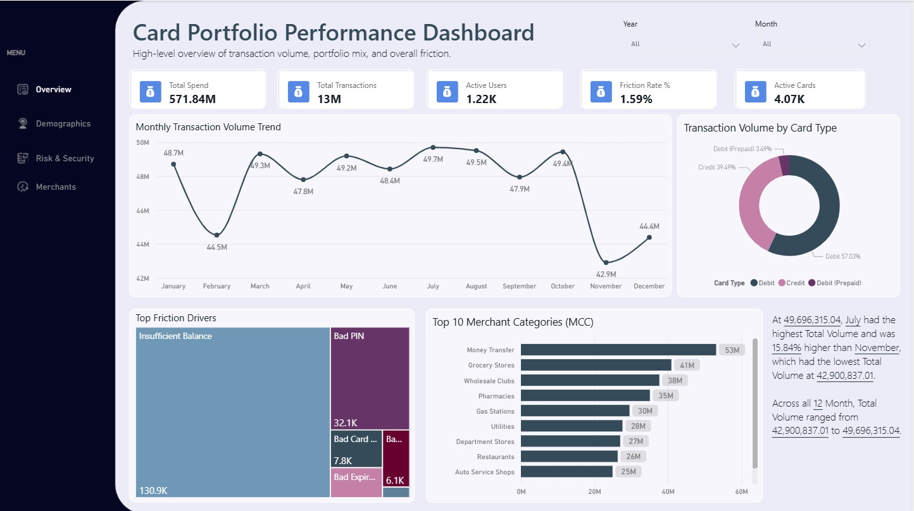
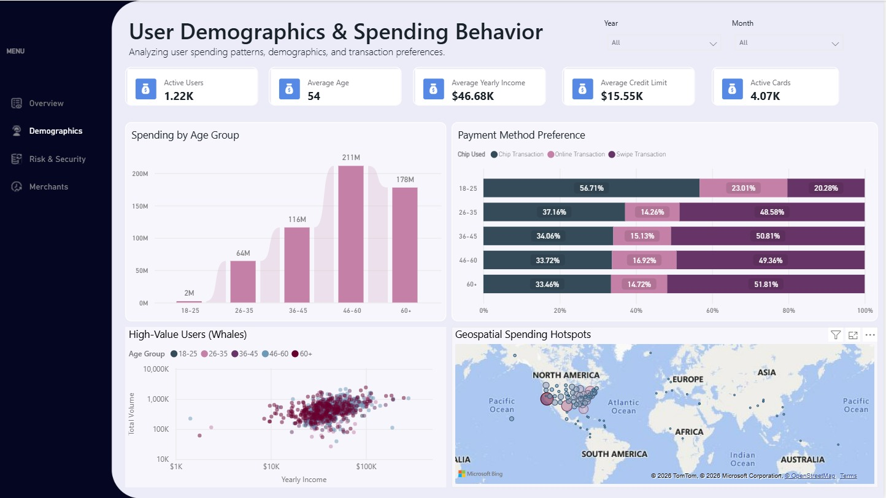

# 💳 Enterprise Card Portfolio & Risk Analytics Dashboard

[]()
[]()
[]()
[]()

> 📓 **Data Cleaning & EDA Process:** [View Jupyter Notebook Here](Card%20Portfolio%20Analytics.ipynb)
> 📊 **Live Interactive Dashboard:** [Click Here to View Dashboard on Power BI Web]([Insert_Publish_to_Web_Link_Here])

## 📌 Business Case & Objective
In the modern financial landscape, managing a credit card portfolio goes beyond merely tracking transaction volumes; it requires a proactive approach to **mitigating default risks** and **optimizing customer credit limits**. 

This project features an *End-to-End Power BI Dashboard* designed for C-Level Executives and Risk Management Teams. It transforms millions of rows of historical transaction data into actionable insights focused on 3 core pillars:
1. **Portfolio Health:** Monitoring overall transaction volume, spending trends, and demographic metrics.
2. **Operational Friction & Risk:** Identifying root causes of failed transactions and isolating high-risk customers into a targeted watchlist.
3. **Revenue Optimization:** Analyzing spending behaviors across Merchant Categories to guide targeted promotions and upselling strategies.

**Tools Used:** Python (Pandas/Jupyter), Power BI, DAX, Data Modeling, Power Query.

---

## 🚀 Key Insights & Dashboard Previews

### 1. Executive Overview (High-Level Performance)

* **Key Insight:** The portfolio successfully processed **$571.84 Million** across 13 Million transactions.
* **Friction Identification:** Identified a Friction Rate of 1.59%. Transaction failures are primarily driven by operational issues such as **Insufficient Balance** and **Bad PIN**, rather than server-side technical glitches.

### 2. User Demographics & Spending Behavior

* **Geospatial Hotspots:** Transaction distribution is heavily concentrated on the East and West Coasts of North America.
* **Demographics:** The highest spending volume is generated by late-career professionals (aged 46-60), showcasing a strong preference for Chip-based payment methods over Swipe or Online transactions.

### 3. Risk Management & Security Anomalies

* **High-Risk Watchlist:** Features a scatter plot correlating Credit Scores and Debt Ratios. Customers with low Credit Scores but high Debt Ratios are immediately isolated into a Watchlist table for urgent credit limit reviews by the Risk team.
* **Operational Heatmap:** Reveals peak hours for technical anomalies, enabling the IT team to schedule precise and non-disruptive server maintenance windows.

### 4. Merchant Patterns & Credit Utilization

* **Revenue Opportunity:** Customer spending flows heavily into *Grocery Stores*, *Gas Stations*, and *Fast Food*. These sectors are ideal for targeted cashback or points reward campaigns.
* **Utilization Gap:** The average Credit Utilization Rate sits at a remarkably low **3%**. This presents a massive opportunity for upselling and increasing credit limits for premium customers who have excellent Credit Scores but frequently encounter 'Insufficient Balance' constraints.

---

## 🛠️ Technical Stack & Data Transformation

This project was built using a comprehensive analytical methodology:
* **Data ETL (Python & Power Query):** Conducted rigorous data cleaning in Jupyter Notebook, handled missing values, and transformed data types to ensure high data integrity before loading into Power BI.
* **Data Modeling:** Engineered an efficient *Star Schema* relationship between Fact tables (Transactions) and Dimension tables (Users, Cards, Merchants).
* **Advanced DAX:** Developed dozens of custom DAX measures. Key business logic implementations include:

**1. Dynamic Merchant Category Mapping (`SWITCH` Function):**
```dax
Merchant Category = 
SWITCH(
    VALUE('clean_credit_behavior'[mcc]),
    5411, "Grocery Stores",
    5541, "Gas Stations",
    5812, "Restaurants",
    5814, "Fast Food",
    "Other (" & 'clean_credit_behavior'[mcc] & ")"
)
**2. Retirement Status Segmentation (IF Logic):**
```dax
Retirement Status = 
IF('clean_credit_behavior'[current_age] >= 'clean_credit_behavior'[retirement_age], "Retired", "Working")

---

## 📂 How to Explore This Project
*1. Clone this repository or download the files to your local machine.
*2. Review the data cleaning process in the provided .ipynb file.
*3. 3. Open the `Card Portfolio Analytics.pbit` file using **Power BI Desktop**.
*4. Use the interactive hover-enabled navigation menu on the left panel to switch between dashboard pages.

**Developed with 💡 and Data by [Virginia Putri Annisa] | [https://www.linkedin.com/in/virginiaputri]


